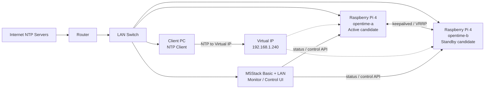

# OpenTime Validation Plan

## 1. 目的

本書は、OpenTime の初期検証計画と作業手順をまとめる文書である。

今回の検証では、最終構成で予定している CM5、GNSS、専用基板、冗長電源、ラック筐体はまだ使用しない。手元にある Raspberry Pi 4 と M5Stack Basic を使い、OpenTime の中核となる以下の要素技術が成立するかを確認する。

- 2 台の小型 Linux コンピュータによる時刻配信
- Active / Standby 構成による冗長化
- 仮想 IP による単一時刻サーバー化
- 片側停止時の自動切り替え
- M5Stack Basic による状態監視と簡易操作

本検証の目的は、完成品の性能を証明することではなく、OpenTimeServer の基本設計が実現可能であることを示すことである。

## 2. 検証の位置づけ

OpenTimeServer の最終目標は、GNSS から正確な時刻を取得し、ネットワーク内の機器へ安定して時刻を配信することである。

ただし、いきなり専用機材を購入して開発する前に、既存機材で確認できる範囲を先に検証する。これにより、計画書に「机上の構想ではなく、予備検証により成立性を確認している」と記載できる。

本検証で確認する範囲:

- Ubuntu Server 24.04 LTS 上で NTP サーバーを構成できること
- Raspberry Pi 4 を 2 台使い、冗長構成を組めること
- クライアントからは 1 台の時刻サーバーのように見えること
- 障害時に Standby 側へ切り替わること
- M5Stack Basic から状態確認や簡易操作ができること

本検証で確認しない範囲:

- GNSS / GPS による時刻取得
- PPS 信号による高精度同期
- CM5 固有の動作
- eMMC 運用
- 専用基板
- 電源 2 系統化
- 1U / 2U 筐体設計

## 3. 使用機材

| 機材 | 数量 | 用途 |
|---|---:|---|
| Raspberry Pi 4 | 2 | NTP サーバー冗長化検証 |
| microSD カード | 2 | OS 起動用 |
| Raspberry Pi 4 用電源 | 2 | 各 Pi への給電 |
| LAN ケーブル | 3 本以上 | Pi、PC、M5Stack の接続 |
| 有線 LAN スイッチ | 1 | 検証用ネットワーク |
| 作業用 PC | 1 | SSH、設定、ログ確認 |
| M5Stack Basic | 1 | 監視 UI / 操作用端末 |
| M5Stack LAN モジュール | 1 | M5Stack の有線 LAN 接続 |
| 2 回路リレーモジュール | 任意 | 電源断試験の半自動化 |

## 4. OS と基本設定

Raspberry Pi 4 には以下の OS を使用する。

| 項目 | 内容 |
|---|---|
| OS | Ubuntu Server 24.04 LTS |
| Architecture | 64-bit |
| Desktop | 不要 |
| SSH | 有効 |
| Wi-Fi | 使用しない |
| Timezone | Asia/Tokyo |
| Keyboard | 使用環境に合わせる |

## 5. ホスト名とネットワーク設計

検証では 2 台の Raspberry Pi 4 に以下の名前を付ける。

| 役割 | Hostname | 用途 |
|---|---|---|
| Primary | `opentime-a` | 初期 Active 側 |
| Secondary | `opentime-b` | 初期 Standby 側 |

ネットワークアドレスは実環境に合わせる。以下は例である。

| 項目 | 例 |
|---|---|
| `opentime-a` 実 IP | `192.168.1.241` |
| `opentime-b` 実 IP | `192.168.1.242` |
| 仮想 IP | `192.168.1.240` |
| Gateway | `192.168.1.1` |
| DNS | `192.168.1.1` または任意の DNS |

仮想 IP は、ルーターの DHCP 配布範囲と重複しない値にする。

## 6. 検証構成図



## 7. 検証フェーズ

### Phase 1: OS インストールと基本接続

目的は、2 台の Raspberry Pi 4 に Ubuntu Server 24.04 LTS を導入し、SSH で操作できる状態にすることである。

手順:

1. Raspberry Pi Imager で Ubuntu Server 24.04 LTS 64-bit を microSD に書き込む。
2. 1 台目の hostname を `opentime-a` にする。
3. 2 台目の hostname を `opentime-b` にする。
4. ユーザー名は `opentime` とする。
5. SSH を有効化する。
6. Wi-Fi は設定せず、有線 LAN を使用する。
7. 2 台を LAN スイッチに接続する。
8. 作業用 PC から SSH 接続する。

確認コマンド:

```bash
hostname
ip addr
timedatectl
```

成功条件:

- `opentime-a` と `opentime-b` の両方へ SSH 接続できる
- 両方がインターネットへ接続できる
- hostname が正しく設定されている

## 8. Phase 2: NTP 再配信検証

目的は、各 Raspberry Pi がインターネット上の NTP サーバーから時刻を取得し、LAN 内へ時刻を配信できることを確認することである。

インストール:

```bash
sudo apt update
sudo apt install -y chrony
```

chrony の状態確認:

```bash
chronyc tracking
chronyc sources -v
```

設定方針:

- `opentime-a` と `opentime-b` は外部 NTP サーバーへ同期する
- LAN 内クライアントからの NTP 問い合わせを許可する
- クライアントは最終的に仮想 IP を参照する

検証時に記録する項目:

- `chronyc tracking` の結果
- `chronyc sources -v` の結果
- NTP クライアントから同期できたか

成功条件:

- `opentime-a` と `opentime-b` の両方で chrony が動作している
- 両方が外部 NTP サーバーと同期できる
- LAN 内のクライアントから NTP サーバーとして参照できる

## 9. Phase 3: Active / Standby 検証

目的は、2 台の Raspberry Pi 4 を Active / Standby 構成にし、仮想 IP によってクライアントから 1 台の時刻サーバーとして見せることである。

使用するソフトウェア:

- `keepalived`
- `chrony`

インストール:

```bash
sudo apt install -y keepalived
```

検証する状態:

| 状態 | 期待結果 |
|---|---|
| 両方正常 | `opentime-a` が仮想 IP を持つ |
| `opentime-a` 停止 | `opentime-b` が仮想 IP を引き継ぐ |
| `opentime-a` 復旧 | 設定方針に従い Active が戻る、または `opentime-b` が継続する |
| `opentime-b` 停止 | `opentime-a` が継続する |

確認コマンド:

```bash
ip addr
systemctl status keepalived
journalctl -u keepalived --no-pager -n 100
```

成功条件:

- 仮想 IP がどちらか一方の Raspberry Pi に付与される
- Active 側停止時に Standby 側へ仮想 IP が移動する
- クライアントは仮想 IP のみを NTP サーバーとして参照できる

## 10. Phase 4: 障害試験

目的は、障害時の切り替え挙動を確認し、OpenTimeServer の冗長化設計に必要な知見を得ることである。

試験項目:

| 試験 | 方法 | 期待結果 |
|---|---|---|
| chrony 停止 | Active 側で `sudo systemctl stop chrony` | 状態異常を検出できる |
| keepalived 停止 | Active 側で `sudo systemctl stop keepalived` | Standby 側へ仮想 IP が移る |
| OS 停止 | Active 側で `sudo shutdown now` | Standby 側へ切り替わる |
| LAN 抜線 | Active 側の LAN ケーブルを抜く | Standby 側へ切り替わる |
| 電源断 | Type-C 電源を抜く | Standby 側へ切り替わる |
| リレー電源断 | リレーで 5V 給電を切る | Standby 側へ切り替わる |

記録する項目:

- 切り替え発生時刻
- 仮想 IP が移動するまでの時間
- NTP クライアントへの影響
- M5Stack 側の表示
- 復旧後の状態

成功条件:

- Active 側障害時に Standby 側へ切り替わる
- 切り替え手順と観測結果を記録できる
- どの障害が検出しやすく、どの障害が検出しにくいかを整理できる

## 11. Phase 5: M5Stack Basic 監視 UI 検証

目的は、M5Stack Basic と LAN モジュールを使い、OpenTimeServer の前面監視 UI の原型を検証することである。

初期検証では、M5Stack から各 Raspberry Pi へ HTTP または ping で死活監視を行う。

表示したい情報:

- `opentime-a` の状態
- `opentime-b` の状態
- 仮想 IP の応答状態
- 現在 Active になっているノード
- chrony の状態
- 異常時の警告表示

操作候補:

| 操作 | 内容 |
|---|---|
| Status | 2 台の状態を表示する |
| Manual Failover | Active 側の優先度を下げる、または keepalived を停止する |
| Reboot | 指定ノードを再起動する |
| Alarm Reset | 表示上のアラートを解除する |

初期段階では、M5Stack から直接 SSH しない。Raspberry Pi 側に小さな HTTP API を用意し、M5Stack はその API を呼び出す方式を検討する。

API 例:

```text
GET  http://opentime-a:8080/status
GET  http://opentime-b:8080/status
POST http://opentime-a:8080/failover
POST http://opentime-b:8080/reboot
```

成功条件:

- M5Stack 画面で 2 台の状態を確認できる
- Active / Standby の状態を表示できる
- 片側停止時に表示が変化する
- 少なくとも 1 つの簡易操作を実行できる

## 12. ログと記録

検証結果は、後から計画書や README に反映できるように記録する。

記録する内容:

- 検証日
- 使用機材
- OS バージョン
- IP アドレス
- chrony 設定
- keepalived 設定
- 障害試験の結果
- 切り替え時間
- M5Stack 表示の写真
- 課題
- 次に改善する点

ログ取得コマンド例:

```bash
date
uname -a
lsb_release -a
hostname
ip addr
chronyc tracking
chronyc sources -v
systemctl status chrony --no-pager
systemctl status keepalived --no-pager
journalctl -u keepalived --no-pager -n 200
```

## 13. 最終的な検証成功条件

本検証全体の成功条件は以下である。

- Raspberry Pi 4 を 2 台使い、LAN 内へ NTP を再配信できる
- クライアントは仮想 IP のみを参照して時刻同期できる
- Active 側停止時に Standby 側へ切り替わる
- 障害時の挙動を記録できる
- M5Stack Basic から状態を確認できる
- 今後の CM5 / GNSS / 専用基板検証へ進む根拠を得られる

## 14. 計画書への反映予定

本検証が完了したら、`docs/opentime-prototype-plan.md` に以下の内容を追記する。

- 既存機材による予備検証を実施したこと
- 2 台構成による NTP 冗長化の成立性
- 仮想 IP による切り替えの確認結果
- M5Stack Basic による監視 UI の成立性
- 今後の課題として GNSS / PPS / CM5 / 冗長電源が残ること

計画書には、以下のような表現を追加することを想定する。

> 既存機材による予備検証により、2 台の小型 Linux コンピュータを用いた NTP 配信冗長化、仮想 IP による切り替え、M5Stack Basic による状態監視 UI の基本成立性を確認した。

## 15. 次のアクション

1. Raspberry Pi 4 に Ubuntu Server 24.04 LTS をインストールする。
2. `opentime-a` と `opentime-b` の SSH 接続を確認する。
3. chrony を導入し、NTP 再配信を確認する。
4. keepalived を導入し、仮想 IP を設定する。
5. 障害試験を行う。
6. M5Stack Basic の監視 UI PoC を作成する。
7. 検証結果を本リポジトリへ記録する。
